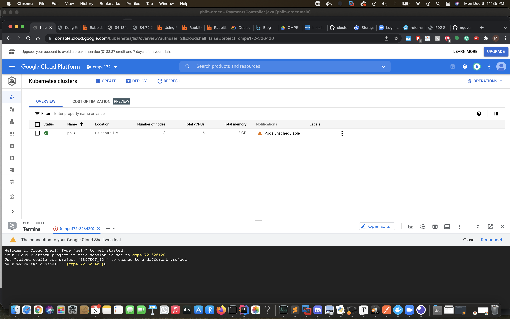
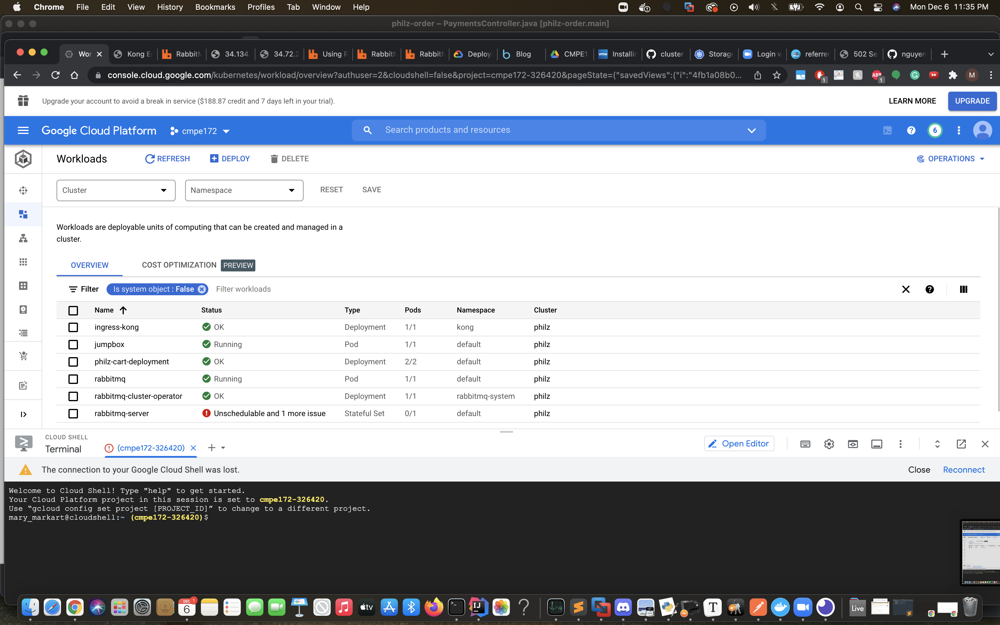

# Mary's Journal

*Overall, the bulk of my work was performed on API's. It started with a PhilzCart microservice that added had a list of products and added them to a cart. We ran into issues along the way and ended up needing to delete a lot of fuctionality to our site because of frontend backend interractions. I created the Postman scripts for API testing and helped refine the @PostMapping and @GetMapping until we found solutions to issues we were facing in the front end*

## Week of October 24th - 30th

#### 10/30/2021

- We decided we would model our project after Philz Coffee

## Week of November 21st-27th

#### 11/21/2021

- We held our first official Team meeting and decided what the structure of our project would look like 

- We used Lab 5 as the base starter code for our project

#### 11/23/2021

- We started divided up task and responsibilties into
  1. Database - Hugh
  2. Cybersource - Ryan
  3. Security + Frontend - Ngan
  4. API's + RabbitMQ - Mary

## Week of November 28th - December 4th

#### 11/28/2021

##### Mary

- Started implementing APIs for ordering. I modelled Orders after lab 8
  - https://github.com/nguyensjsu/fa21-172-the-beacons-are-lit/commit/d15334204be8b5a4beab259127ea18ec8c4a4c5a

#### 12/3/2021

- I started working on implementing a PhilzProduct Entity and a PhilzCart Entity. We wanted a Cart that could store a List of PhilzProducts to be purchased.

- There is discussion about whether the Products should be hardcoded or stored in memory and both ways are implemented and tested to see which is easier to work with. The PhilzProducts are stored as an @Entiity in memory to make . Ultimately, it came down to that I had written the code to account for PhilzProducts being stored in a database and the code added to hardcode the products made everything confusing so I erased the hardcoded things and continued with my progress.

- PhilzCart and PhilzProducts are created

  ````java
  @Entity
  @Table(name = "CUSTOMER_CART")
  @ToString
  @Setter
  @EqualsAndHashCode
  @RequiredArgsConstructor
  @Getter
  public class PhilzCart {
  
      private @Id @GeneratedValue Long id;
  
      @OneToMany
      private List<PhilzProducts> order;
  
      private String userId;
  
      private Status status;
  
      private double total;
  
      public void addProduct(PhilzProducts product) {
          order.add(product);
      }
  }
  ````

  ```java
  @Entity
  @Table(name="PhilzProducts")
  @Data
  @RequiredArgsConstructor
  public class PhilzProducts {
  	@Id @GeneratedValue
  	long id;
  	String name;
  	String roast;
  	final double price = 18.50;
  
  } 
  ```

#### 12/4/2021

- Finished PhilzCart and Tested all the APIs with Postman
  - https://github.com/nguyensjsu/fa21-172-the-beacons-are-lit/commit/26d4c4a8e30114047d56f217b9f1b814003fef06
- Around this time we were noticing that POST requests aren't handled very well in the frontend. I was hard for Ngan to figure out how to pass a cart full of objects to payments.
- I was having difficulties getting PhilzProducts to be persistent in the PhilzCart database. I started implementation of a Map the mapped a list of Products to an order id. In the end, I decided it was best to add orders to a productList to be returned from a get request.

### December 5, 2021

- There were issues with PhilzCart working on the frontend so PhilzCart was merged with PhilzPayment so that we could consoladate the number of POST requests we needed. This means that it was decided that all the work I had done previously was going to be removed and I would have to focus my efforts on collaborating with Ryan on payments.

- I created the post-man api file for everyone to test the APIs

- Ryan and I peer programmed the RabbitMQ aspect in our program and got it running to send a message with an order number after a customer purchases a bag of coffee.

  ### Payment API and RabbitMQ Message

  

  

### December 6th, 2021

- Finalized testing of APIs and deployed philz-cart to GKE

  

  

  

  

  

  

  

  

  

